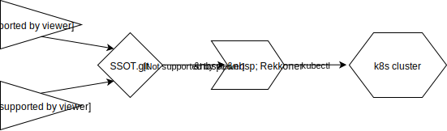

rekkoner
========

Rekkoner is a way to operate kubernetes (a.k.a. k8s) clusters declaratively.

Yes, that's what kubernetes was about in the first place.
Yes, we needed to write another layer around it because the ball got dropped real bad.

motivation: we like git
-----------------------

We want our entire cluster configuration to be declared and version controlled.
There are many version control systems, but ours is git, and we expect `git checkout`
to contain **all** the information necessary to produce a working cluster.

When producing changes, this means we commit them to git -- nothing special.
Whatever the cause of our change was, we route our control through git, so that we
have a simple audit log as well as a revert/rollback mechanism already familiar to us.
Rekkoner picks up changes by watching a git branch, so integrating with rekkoner
just means producing git commits and pushing them to the repo that rekkoner watches.

When applying changes, Rekkoner "simply" needs to `kubectl apply -f *`... **except**:
k8s is not declarative, which makes doing this *right* into something *much* more complicated.

motivation: k8s is not declarative
----------------------------------

Kubernetes keeps state.

Like any system that keeps state, if we have a declared intent that we want the system
to converge on, we now need an intelligent annealing process running in a reconciliation loop.

This is easiest to understand with a concrete example:

- You create 'service-A.yaml' and run `kubectl apply -f *`.
  - So far, so good -- Cluster now contains: 'service-A'.
- You create 'service-B.yaml' and run `kubectl apply -f *`.
  - So far, so good -- Cluster now contains: 'service-A','service-B'.
- You change 'service-A.yaml' and run `kubectl apply -f *`.
  - So far, so good -- Cluster now contains: 'service-A','service-B', both at their latest declarations.
- You remove 'service-A.yaml' and run `kubectl apply -f *`.
  - FAIL!!!  Cluster now contains 'service-A','service-B' -- you didn't remember to explicitly invoke
    the delete commands (and wait for the delete to complete, and check that it completed correctly),
    so the state in the cluster *outlives your declared intentions*.

When you remove something from your declared, intended state, it should *go away*.
Unfortunately, basic `kubectl` commands *do not provide this ability* because they're
designed to apply changes *piecemeal* and statefully.

Rekkoner solves these problems because it's designed around the concept of knowing
your *entire* declared intended state at one time, meaning it can tell when things
shouldn't be taking up a seat at the table any more.

design: rekkoner is a linearized actor
--------------------------------------

Rekkoner acts on a git repository.  This repository in effect forces all change
to be linear, which makes operations very easy to understand, predict, and control.

It's easy to make other things integrate with this flow, because all you
have to do to make automated changes is push them:
`git pull && your-change.sh && git commit -a . && git push`!

Many different systems, both automated and human, can freely make changes
to the "single-source-of-truth" git repo.  The `git push` itself to the central
repository is the only point of synchronization.
The git repository isn't a lock or mutex -- which is why you shouldn't be
doing `kubectl apply` commands from various actors without some coordination --
but it *is* a linearizer, and that turns out to suit our needs.

Running more than one Rekkoner process on the same repo is probably not going
to break everything, because they should both end up annealing in the same
direction anyway, but it's certainly silly and you shouldn't do it.

design: rekkoner controls only one namespace
--------------------------------------------

Rekkoner is designed to maintain total control of a system *including deletion* when
it observes resources which have no matching declaration in source control.
This is important for a correct system (and for avoiding what are essentially
"memory leaks" but with full (and billable!) resources), but it's also potentially
scary, because we said "delete".

To make this managable and safe, Rekkoner is designed to only operate a whitelisted
[kubernetes namespace](https://kubernetes.io/docs/concepts/overview/working-with-objects/namespaces/).
Rekkoner will only create, destroy, and monitor resources inside the namespaces you've configured.

design: rekkoner should be able to tell you what's true
-------------------------------------------------------

Rekkoner has some features of a monitoring dashboard.

Since it's already Rekkoner's job to find out what's true in the cluster so that
it can take steps to anneal that state towards your declared intentions, we
figure Rekkoner might as well be able to *tell* you what it knows.

You may still want other dashboards for monitoring, but Rekkoner can certainly
tell you some basics about whether or not your deployments are rolling out,
whether or not you have orphaned resources that will be deleted soon, etcetera.
